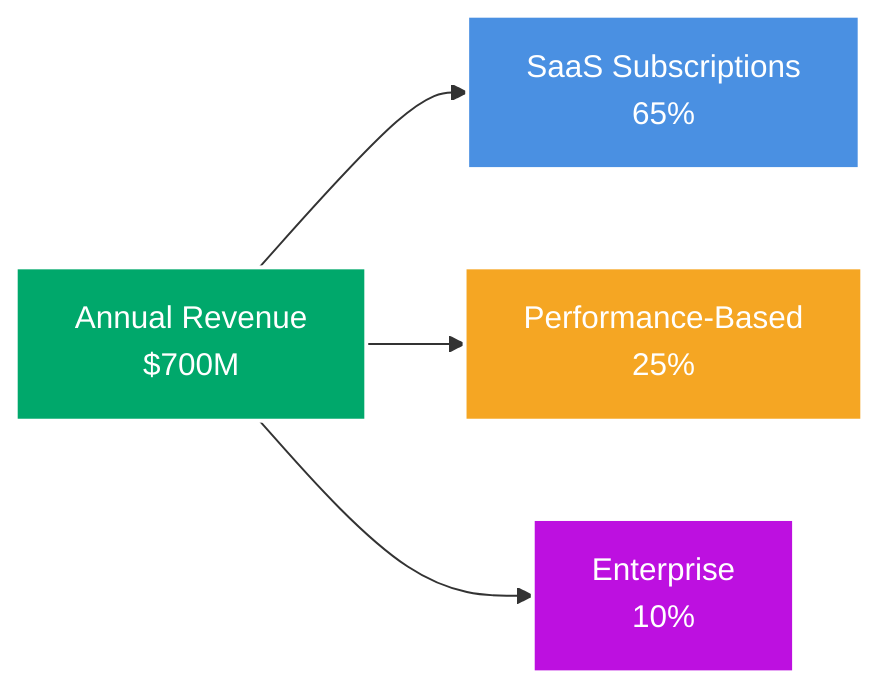
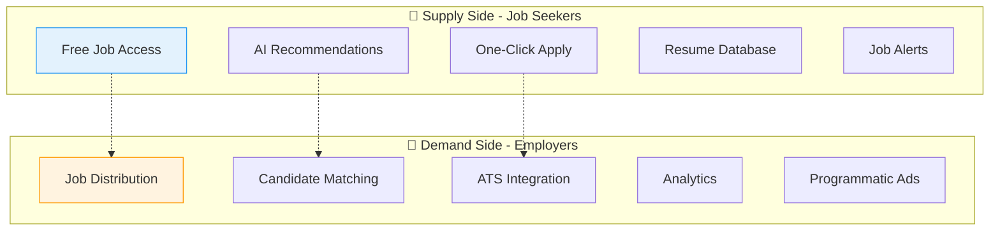
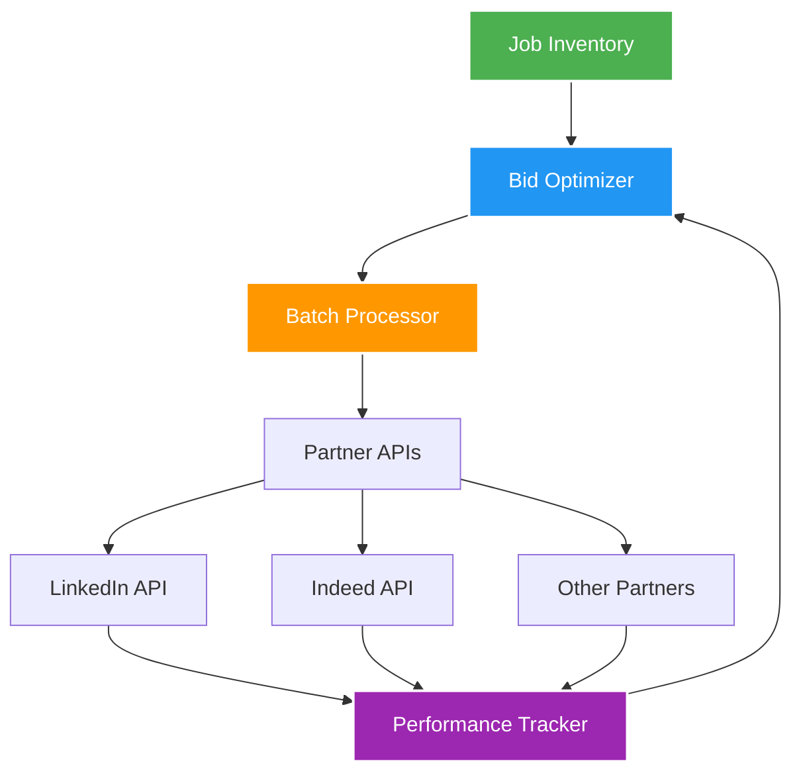

# 🚀 ZipRecruiter Overview: Engineering Leadership Transition Guide

<div align="center">


### 📊 **A Comprehensive Guide for Engineering Leaders**
#### *Transitioning from Programmatic Advertising (Taboola) to Recruitment Technology (ZipRecruiter)*

</div>

---

## 📋 **Executive Summary**

### 🌍 **Market Position**

<table>
<tr>
<td width="50%">

#### 🏢 **Company Overview**
- 🏆 **#1** rated job search app (iOS/Android)
- 📅 **Founded**: 2010
- 👥 **Employees**: 1,200+
- 🌐 **Markets**: US, UK, Canada

</td>
<td width="50%">

#### 📈 **Platform Scale**
- 👤 **12M+** active job seekers
- 🏢 **1.8M+** employers
- 🔄 **3B+** annual job-candidate matches
- 📱 **67%** mobile traffic

</td>
</tr>
</table>

### 🎯 **Key Differentiators**

| Feature | Description | Impact |
|:--------|:------------|:-------|
| 🤖 **AI-Powered Matching** | Proprietary Phil algorithm with ML | 40% better match rate |
| 📡 **One-Click Distribution** | Post to 100+ job boards instantly | 10x reach |
| ⚡ **Speed to Market** | First candidate in 24 hours | 3-5x faster |
| 📱 **Mobile-First** | Native mobile experience | 67% mobile usage |
| 💻 **Programmatic Platform** | RTB & batch processing | Enterprise scale |

### 💰 **Revenue Model & Scale**

<div align="center">



</div>

#### 📊 **Key Metrics**
- 💹 **Market Cap**: ~$1.2B (NYSE: ZIP)
- 📈 **MAU**: 30M+ job seekers, 100K+ employers
- 🌍 **Geographic Presence**: 3 countries
- 👥 **Team Size**: 1,200+ employees

## 💼 **Business Model & Core Value Proposition**

### 🔄 **The Two-Sided Marketplace**

<div align="center">



</div>

### 💰 **Revenue Streams**

<table>
<thead>
<tr>
<th>Revenue Stream</th>
<th>Description</th>
<th>% of Revenue</th>
<th>Growth</th>
</tr>
</thead>
<tbody>
<tr>
<td><strong>📊 Subscription Plans</strong></td>
<td>Monthly/annual job posting subscriptions</td>
<td><code>65%</code></td>
<td>🔺 15% YoY</td>
</tr>
<tr>
<td><strong>⚡ Performance-Based</strong></td>
<td>CPC and CPA pricing models</td>
<td><code>25%</code></td>
<td>🚀 35% YoY</td>
</tr>
<tr>
<td><strong>🏢 Enterprise</strong></td>
<td>Custom integrations & white-label</td>
<td><code>10%</code></td>
<td>🔥 45% YoY</td>
</tr>
</tbody>
</table>

### 🔗 **Comparison to Programmatic Advertising**

<div style="background: linear-gradient(135deg, #667eea 0%, #764ba2 100%); padding: 20px; border-radius: 10px; color: white;">

#### ✅ **Similarities to Taboola's Model**

| Feature | ZipRecruiter | Taboola Equivalent |
|:--------|:------------|:-------------------|
| 🎯 **Real-Time Bidding** | Job inventory auctions | Ad exchange bidding |
| 📊 **Quality Scoring** | Relevance algorithms | Ad quality scores |
| 💹 **Yield Optimization** | Dynamic job pricing | Supply-demand pricing |
| 🌐 **Partner Networks** | Job board distribution | Publisher network |
| 📈 **Performance Metrics** | CPC/CPA models | Same KPIs |

</div>

<div style="background: linear-gradient(135deg, #f093fb 0%, #f5576c 100%); padding: 20px; border-radius: 10px; margin-top: 10px; color: white;">

#### ⚠️ **Key Differences**

- 🔄 **Conversion Complexity**: Applications require 10x more engagement than clicks
- 🤝 **Bilateral Matching**: Both employer AND candidate must show interest
- ⚖️ **Regulatory Compliance**: EEOC, labor laws, data privacy requirements
- ⏱️ **Sales Cycles**: 3-6 months for enterprise vs weeks for ad deals

</div>

## 📦 **Products & Services Portfolio**

### 🏢 **For Employers**

#### 💎 **Core Job Posting Products**

<div style="display: grid; grid-template-columns: repeat(3, 1fr); gap: 20px;">

<div style="background: #f8f9fa; padding: 20px; border-radius: 10px; border-left: 4px solid #28a745;">

##### 🥉 **Standard Plan**
`$249-$349/month`

- ✅ Post unlimited jobs
- 📡 Distribute to 100+ boards
- 🤖 Basic candidate matching
- 📧 Email & phone support

</div>

<div style="background: #f8f9fa; padding: 20px; border-radius: 10px; border-left: 4px solid #ffc107;">

##### 🥈 **Premium Plan**
`$449-$649/month`

- ✅ All Standard features
- 🚀 Advanced AI (Phil 2.0)
- ⭐ Priority placement
- 🏢 Branded profile
- 🔗 ATS integration

</div>

<div style="background: #f8f9fa; padding: 20px; border-radius: 10px; border-left: 4px solid #dc3545;">

##### 🥇 **Enterprise**
`Custom Pricing`

- 🔌 API bulk posting
- ⚙️ Custom workflows
- 👤 Dedicated manager
- 📊 99.9% SLA
- 🏷️ White-label

</div>

</div>

#### 🛠️ **Advanced Features**

<details>
<summary><b>🔌 API Integration Example</b> (Click to expand)</summary>

```javascript
// 🚀 Example API Integration for Bulk Job Posting
const zipRecruiterAPI = {
  endpoint: 'https://api.ziprecruiter.com/v2/jobs/batch',
  method: 'POST',
  headers: {
    'Authorization': 'Bearer ${API_KEY}',
    'Content-Type': 'application/json'
  },
  payload: {
    jobs: [
      {
        title: 'Software Engineer',
        location: 'San Francisco, CA',
        salary_range: '$120k-$180k',
        requirements: ['Python', 'AWS', 'Kubernetes'],
        distribution_channels: ['linkedin', 'indeed', 'glassdoor']
      }
    ],
    bidding_strategy: {
      type: 'target_cpa',
      target_cost: 25.00,
      daily_budget: 500.00
    }
  }
};
```

</details>

### 👤 **For Job Seekers**

<table>
<tr>
<td width="50%">

#### 📱 **Mobile App Features**

- 🔍 **Smart Search** - NLP-powered queries
- ⚡ **Quick Apply** - One-tap applications
- 📊 **Job Tracker** - Status monitoring
- 💰 **Salary Estimator** - ML predictions
- 🎯 **Interview Prep** - AI-generated Q&A

</td>
<td width="50%">

#### 💻 **Web Platform**

- 📄 **Resume Builder** - ATS-optimized
- 🏆 **Skills Assessment** - Certifications
- ⭐ **Company Reviews** - Glassdoor data
- 📈 **Career Path** - ML trajectory analysis

</td>
</tr>
</table>

### 🏗️ **Enterprise & API Solutions**

#### ⚙️ **Integration Capabilities**

<table style="background: linear-gradient(135deg, #667eea 0%, #764ba2 100%); color: white; border-radius: 10px;">
<thead>
<tr style="background: rgba(0,0,0,0.2);">
<th>🔌 Integration</th>
<th>📋 Use Case</th>
<th>📊 Capacity</th>
<th>⚡ SLA</th>
</tr>
</thead>
<tbody>
<tr>
<td><b>REST API</b></td>
<td>Real-time posting</td>
<td><code>1,000 req/min</code></td>
<td><code><200ms p99</code></td>
</tr>
<tr>
<td><b>Batch API</b></td>
<td>Bulk uploads</td>
<td><code>100K jobs/hr</code></td>
<td><code>5min</code></td>
</tr>
<tr>
<td><b>Webhook</b></td>
<td>Notifications</td>
<td><code>10K events/min</code></td>
<td><code><500ms</code></td>
</tr>
<tr>
<td><b>SFTP</b></td>
<td>Legacy systems</td>
<td><code>1M records/day</code></td>
<td><code>Hourly</code></td>
</tr>
</tbody>
</table>

## 🌐 **Partner Ecosystem & Distribution Network**

### 🤝 **Major Distribution Partners**

<div style="background: #f0f8ff; padding: 20px; border-radius: 10px;">

#### 🥇 **Tier 1 Partners** (Direct Integration)

| Partner | Reach | Integration |
|:--------|:------|:------------|
| **Indeed** | 👥 250M+ visitors/month | Direct API |
| **LinkedIn** | 👔 200M+ US members | OAuth 2.0 |
| **Glassdoor** | ⭐ 60M+ visitors/month | REST API |
| **Google Jobs** | 🔍 Structured data | Schema.org |

#### 🥈 **Tier 2 Partners** (Syndication)

- 🎯 100+ niche job boards
- 💼 Industry platforms (Dice, AngelList)
- 🌍 Regional job sites
- 🎓 University career centers

</div>

### 🤝 **Strategic Partnerships**

<div style="display: grid; grid-template-columns: repeat(2, 1fr); gap: 15px;">

<div style="background: #e8f5e9; padding: 15px; border-radius: 8px;">

#### 💼 **ATS Integrations**
- Workday
- SAP SuccessFactors
- Greenhouse
- Lever

</div>

<div style="background: #fff3e0; padding: 15px; border-radius: 8px;">

#### 📊 **HRIS Systems**
- BambooHR
- ADP
- Paycom

</div>

<div style="background: #e3f2fd; padding: 15px; border-radius: 8px;">

#### 📋 **CRM Platforms**
- Salesforce
- HubSpot

</div>

<div style="background: #fce4ec; padding: 15px; border-radius: 8px;">

#### 📈 **Analytics**
- Tableau
- Looker
- Google Analytics

</div>

</div>

### Batch Bidding Mechanisms

```python
# Example Batch Bidding Logic
class BatchBiddingEngine:
    def __init__(self):
        self.partners = ['linkedin', 'indeed', 'glassdoor']
        self.bid_optimizer = BidOptimizer()
    
    def process_batch(self, jobs_batch):
        """Process batch of jobs for partner distribution"""
        
        optimized_bids = []
        for job in jobs_batch:
            # Calculate optimal bid based on historical performance
            base_bid = self.calculate_base_bid(job)
            
            # Apply partner-specific multipliers
            partner_bids = {}
            for partner in self.partners:
                multiplier = self.get_partner_multiplier(partner, job)
                partner_bids[partner] = base_bid * multiplier
            
            optimized_bids.append({
                'job_id': job['id'],
                'bids': partner_bids,
                'budget_allocation': self.allocate_budget(partner_bids)
            })
        
        return self.submit_to_exchange(optimized_bids)
```

## 💻 **Technical Architecture & Engineering Aspects**

### 🔧 **Core Technology Stack**

<div style="background: linear-gradient(135deg, #667eea 0%, #764ba2 100%); padding: 25px; border-radius: 15px; color: white;">

#### 🎐 **Backend Infrastructure**

| Component | Technologies | Usage |
|:----------|:------------|:------|
| **Languages** |    | Core services |
| **Frameworks** | Spring Boot, Django, Gin | API & services |
| **Databases** | PostgreSQL, MongoDB, Redis | Data storage |
| **Messaging** | Apache Kafka, RabbitMQ | Event streaming |
| **Search** | Elasticsearch (100+ nodes) | Job search |

#### 🎨 **Frontend Stack**

| Component | Technologies | Purpose |
|:----------|:------------|:--------|
| **Web** | React 18, Next.js, TypeScript | Web apps |
| **Mobile** | React Native | iOS/Android |
| **State** | Redux, Zustand | State mgmt |
| **UI** | Custom DS + Material-UI | Components |

#### ☁️ **Infrastructure & DevOps**

| Service | Provider/Tool | Purpose |
|:--------|:-------------|:--------|
| **Cloud** | AWS (primary), GCP (ML) | Infrastructure |
| **Orchestration** | Kubernetes (EKS) | Container mgmt |
| **CI/CD** | Jenkins, GitLab CI, ArgoCD | Deployment |
| **Monitoring** | Datadog, New Relic, Grafana | Observability |

</div>

### Data & ML Infrastructure

#### Machine Learning Pipeline

```yaml
# ML Pipeline Configuration
pipeline:
  name: job_candidate_matching
  version: 2.3.0
  
  stages:
    - feature_extraction:
        source: ['resume_text', 'job_description', 'user_behavior']
        processors:
          - nlp_tokenizer
          - skill_extractor
          - embedding_generator
    
    - model_inference:
        models:
          - candidate_ranking_model (TensorFlow)
          - salary_prediction_model (XGBoost)
          - churn_prediction_model (PyTorch)
        
    - post_processing:
        - relevance_scoring
        - diversity_optimization
        - business_rules_application
    
  infrastructure:
    compute: GPU_cluster (p3.8xlarge x 10)
    storage: S3 + DynamoDB
    orchestration: Airflow
    serving: SageMaker endpoints
```

#### Data Architecture

**Data Lake (S3)**
- Raw job postings: 500TB
- Resume database: 200TB
- User interaction logs: 1PB
- Partner feed data: 100TB

**Data Warehouse (Snowflake)**
- Structured analytics data: 50TB
- Daily ETL pipelines: 10,000+ jobs
- Query performance: <2s for 90% of queries

**Real-time Processing**
- Kafka topics: 200+
- Message throughput: 1M messages/second peak
- Stream processing: Apache Flink, Spark Streaming

### Integration & API Architecture

#### API Gateway Design

```typescript
// API Gateway Configuration
interface APIGatewayConfig {
  endpoints: {
    public: {
      rateLimit: 100, // requests per second
      authentication: 'api_key',
      endpoints: [
        '/v2/jobs/search',
        '/v2/jobs/apply',
        '/v2/companies/{id}'
      ]
    },
    partner: {
      rateLimit: 1000,
      authentication: 'oauth2',
      endpoints: [
        '/v2/batch/jobs',
        '/v2/batch/applications',
        '/v2/analytics/performance'
      ]
    },
    internal: {
      rateLimit: 10000,
      authentication: 'mTLS',
      endpoints: [
        '/internal/matching/score',
        '/internal/ml/predict',
        '/internal/cache/invalidate'
      ]
    }
  }
}
```

### 🚀 **Scale & Performance**

<div style="background: #1a1a2e; color: white; padding: 20px; border-radius: 10px;">

#### 📊 **System Metrics Dashboard**

```
┌──────────────────────────────────────────────────┐
│ Daily Active Users:     2M+ seekers      │
│                         50K+ employers   │
│ API Requests:           500M+ daily      │
│ DB Transactions:        1B+ daily        │
│ Search Queries:         50M+ daily       │
│ Email Notifications:    100M+ daily      │
└──────────────────────────────────────────────────┘
```

#### ⚡ **Performance Optimizations**

| Layer | Technology | Performance |
|:------|:-----------|:------------|
| **CDN** | CloudFront | 95% cache hit |
| **Sharding** | Horizontal | By user_id/job_id |
| **Cache L1** | In-memory | <1ms latency |
| **Cache L2** | Redis cluster | <10ms latency |
| **Cache L3** | CDN edge | Global distribution |
| **Query Opt** | Materialized views | 10x faster |

</div>

## 🏆 **Competitive Landscape**

### 📊 **Market Analysis**

<table style="background: #f8f9fa; border-radius: 10px;">
<thead style="background: linear-gradient(90deg, #667eea 0%, #764ba2 100%); color: white;">
<tr>
<th>Competitor</th>
<th>Market Share</th>
<th>✅ Strengths</th>
<th>❌ Weaknesses</th>
<th>💰 Revenue</th>
</tr>
</thead>
<tbody>
<tr>
<td><b>Indeed</b></td>
<td><code>35%</code></td>
<td>Largest inventory, global</td>
<td>Poor tools, expensive</td>
<td>$3.5B</td>
</tr>
<tr style="background: #f0f0f0;">
<td><b>LinkedIn</b></td>
<td><code>25%</code></td>
<td>Network, quality</td>
<td>Limited blue-collar</td>
<td>$15B*</td>
</tr>
<tr>
<td><b>ZipRecruiter</b></td>
<td><code>12%</code></td>
<td>AI matching, distribution</td>
<td>Limited international</td>
<td>$700M</td>
</tr>
<tr style="background: #f0f0f0;">
<td><b>Monster</b></td>
<td><code>8%</code></td>
<td>Brand, enterprise</td>
<td>Outdated tech</td>
<td>$600M</td>
</tr>
<tr>
<td><b>CareerBuilder</b></td>
<td><code>6%</code></td>
<td>Enterprise, database</td>
<td>Poor UX</td>
<td>$700M</td>
</tr>
<tr style="background: #f0f0f0;">
<td><b>Others</b></td>
<td><code>14%</code></td>
<td>Niche focus</td>
<td>Limited scale</td>
<td>Varies</td>
</tr>
</tbody>
</table>

### Competitive Advantages

**Technology Differentiation**
- Phil AI algorithm: 40% better match rate than industry average
- One-click apply: 3x higher application completion rate
- Mobile-first design: 67% mobile traffic vs 45% industry average

**Business Model Innovation**
- Subscription + performance hybrid model
- Transparent pricing (no hidden fees)
- Self-service platform for SMBs
- Programmatic job advertising platform

### Industry Trends

**Emerging Opportunities**
- **AI-Powered Recruiting**: $3.9B market by 2027 (38% CAGR)
- **Video Interviewing**: Post-COVID standard practice
- **Skills-Based Hiring**: Moving beyond degree requirements
- **Gig Economy Integration**: Freelance/contract job matching
- **International Expansion**: APAC and LATAM markets

## 📈 **Key Metrics & KPIs**

### 📊 **Business Metrics**

#### 🚀 **Growth Metrics Dashboard**

<div style="background: linear-gradient(135deg, #667eea 0%, #764ba2 100%); padding: 20px; border-radius: 10px; color: white;">

| Metric | Current | Growth | 🎯 Target |
|:-------|:--------|:-------|:---------|
| **Active Employers** | <code>100K+</code> | 📈 25% | 150K |
| **Active Seekers** | <code>12M+</code> | 📈 30% | 20M |
| **Job Postings** | <code>9M+</code> | 🚀 35% | 15M |
| **Applications** | <code>50M+</code> | 🚀 40% | 80M |
| **Successful Hires** | <code>500K+</code> | 📈 20% | 750K |

</div>

**Revenue Metrics**
- **Average Revenue Per User (ARPU)**: $583/month
- **Customer Acquisition Cost (CAC)**: $312
- **Lifetime Value (LTV)**: $7,000
- **LTV/CAC Ratio**: 22.4x
- **Monthly Recurring Revenue (MRR)**: $58M
- **Net Revenue Retention**: 115%

### Technical Metrics

**API Performance**
```json
{
  "response_times": {
    "p50": "45ms",
    "p95": "150ms",
    "p99": "350ms"
  },
  "availability": {
    "uptime": "99.95%",
    "incidents_mtd": 2,
    "mttr": "12 minutes"
  },
  "throughput": {
    "requests_per_second": 5800,
    "batch_jobs_per_hour": 100000,
    "peak_capacity": "15000 rps"
  }
}
```

### Partner Performance Metrics

**Distribution Effectiveness**
- **Partner Coverage**: 100+ integrated job boards
- **Distribution Speed**: 95% posted within 1 hour
- **Partner Fill Rate**: 78% of jobs receive applications
- **Cost Per Application by Channel**:
  - Direct (ZipRecruiter): $8
  - Indeed: $15
  - LinkedIn: $22
  - Niche boards: $12

## 🔍 **Partner Integration Deep Dive**

### 📊 **Batch Bidding Systems**

#### 🏗️ **Architecture Overview**

<div style="background: #f5f5f5; padding: 20px; border-radius: 10px;">



</div>

#### Bidding Strategy Implementation

```java
public class BatchBiddingStrategy {
    private static final int BATCH_SIZE = 1000;
    private static final int PROCESSING_INTERVAL_MS = 60000; // 1 minute
    
    public class JobBid {
        String jobId;
        String partnerId;
        BigDecimal bidAmount;
        BigDecimal dailyBudget;
        TargetingCriteria targeting;
        OptimizationGoal goal; // CPA, CPC, or CONVERSIONS
    }
    
    public BatchBidResponse processBatch(List<Job> jobs) {
        List<JobBid> bids = new ArrayList<>();
        
        for (Job job : jobs) {
            // Calculate base bid using historical performance
            BigDecimal baseBid = calculateBaseBid(job);
            
            // Apply partner-specific strategies
            for (Partner partner : getEligiblePartners(job)) {
                JobBid bid = new JobBid();
                bid.jobId = job.getId();
                bid.partnerId = partner.getId();
                
                // Adjust bid based on partner performance
                bid.bidAmount = adjustBidForPartner(baseBid, partner, job);
                bid.dailyBudget = calculateDailyBudget(job, partner);
                bid.targeting = buildTargetingCriteria(job);
                bid.goal = determineOptimizationGoal(job);
                
                bids.add(bid);
            }
        }
        
        return submitBidsToExchange(bids);
    }
    
    private BigDecimal adjustBidForPartner(BigDecimal base, Partner partner, Job job) {
        // Factor in partner-specific metrics
        double qualityScore = getPartnerQualityScore(partner, job.getCategory());
        double competitionMultiplier = getCompetitionLevel(partner, job.getLocation());
        double historicalCVR = getHistoricalConversionRate(partner, job);
        
        return base.multiply(BigDecimal.valueOf(
            qualityScore * competitionMultiplier * (1 + historicalCVR)
        ));
    }
}
```

### LinkedIn Integration Specifics

#### Current Capabilities

**API Integration Points**
- **Job Posting API**: Direct posting to LinkedIn Jobs
- **Limited Organic Reach**: Posts appear in job search only
- **Apply with LinkedIn**: Profile data extraction
- **Analytics API**: Basic performance metrics

**Technical Limitations**
```yaml
linkedin_api_limits:
  rate_limits:
    jobs_post: 100/hour
    jobs_update: 500/hour
    analytics_fetch: 1000/hour
  
  batch_constraints:
    max_batch_size: 100
    processing_time: "5-10 minutes"
    retry_policy: "exponential_backoff"
  
  data_access:
    candidate_profiles: "limited"
    application_details: "basic_only"
    competitor_data: "not_available"
```

#### Optimization Strategies

**Performance Enhancement Techniques**
1. **Intelligent Batching**: Group similar jobs for better targeting
2. **Budget Pacing**: Distribute spend throughout the day
3. **Dynamic Pricing**: Adjust bids based on real-time performance
4. **A/B Testing**: Continuous optimization of job descriptions

**Integration Architecture**
```python
class LinkedInIntegration:
    def __init__(self):
        self.batch_processor = BatchProcessor()
        self.performance_tracker = PerformanceTracker()
        
    async def process_job_batch(self, jobs):
        # Prepare batch for LinkedIn's format
        linkedin_batch = self.transform_to_linkedin_format(jobs)
        
        # Apply LinkedIn-specific optimizations
        optimized_batch = self.apply_optimizations(linkedin_batch)
        
        # Submit with retry logic
        response = await self.submit_with_retry(optimized_batch)
        
        # Track performance for future optimization
        self.performance_tracker.record(response)
        
        return response
    
    def apply_optimizations(self, batch):
        for job in batch:
            # Title optimization for LinkedIn search
            job['title'] = self.optimize_title_for_linkedin(job['title'])
            
            # Salary transparency (LinkedIn favors this)
            if 'salary' in job:
                job['salary_visible'] = True
            
            # Skills matching optimization
            job['skills'] = self.map_to_linkedin_skills(job['requirements'])
            
        return batch
```

### Competitive Dynamics with LinkedIn

**Coopetition Strategy**
- **Cooperation**: LinkedIn as distribution channel
- **Competition**: Direct employer acquisition
- **Differentiation**: Focus on SMB market vs LinkedIn's enterprise focus
- **Value Proposition**: Lower cost per hire, faster time to fill

## 🎯 **Challenges & Opportunities**

### 🔧 **Technical Challenges**

<div style="background: #fff3e0; padding: 20px; border-radius: 10px; border-left: 5px solid #ff9800;">

#### ⚡ **Scale & Performance**

| Aspect | Challenge | Solution | Investment |
|:-------|:----------|:---------|:-----------|
| **Processing** | 50M+ apps/month @ <100ms | Distributed + edge computing | $5M |
| **Latency** | Current: 200ms → Target: 50ms | GPU inference nodes | $2M |
| **Throughput** | 1K → 5K matches/sec | Event-driven architecture | $3M |

</div>

#### Data Quality
- **Challenge**: Standardizing job data from 100+ sources
- **Solution**: ML-powered data normalization pipeline
- **Current Accuracy**: 92% (target: 98%)

#### Real-time Matching
```python
# Challenge: Match 12M candidates to 9M jobs in real-time
class RealTimeMatchingChallenge:
    """
    Current limitations:
    - Matching latency: 200ms average (target: 50ms)
    - Accuracy: 75% relevance (target: 90%)
    - Scale: 1000 matches/second (need: 5000/second)
    """
    
    def proposed_solution(self):
        return {
            'architecture': 'Event-driven microservices',
            'ml_approach': 'Online learning with edge inference',
            'caching': 'Multi-tier with predictive pre-warming',
            'infrastructure': 'GPU-accelerated inference nodes'
        }
```

### Business Opportunities

#### Programmatic Expansion

**Market Opportunity**
- **Total Addressable Market**: $15B globally
- **Current Penetration**: 5% ($750M)
- **Growth Potential**: 30% CAGR over 5 years

**Implementation Roadmap**
1. **Phase 1** (Q1-Q2): Enhanced API capabilities
2. **Phase 2** (Q3-Q4): Real-time bidding platform
3. **Phase 3** (Year 2): Self-serve DSP launch
4. **Phase 4** (Year 2+): Global expansion

#### AI/ML Enhancements

**Next-Gen Matching Algorithm (Phil 3.0)**
```typescript
interface PhilV3Features {
  // Current capabilities
  skillsMatching: boolean;           // ✓ Implemented
  salaryPrediction: boolean;         // ✓ Implemented
  
  // Planned enhancements
  careerPathPrediction: boolean;     // Q2 2024
  cultureFitScoring: boolean;        // Q3 2024
  videoResumeAnalysis: boolean;      // Q4 2024
  
  // Future innovations
  conversationalAI: boolean;         // 2025
  virtualRecruiter: boolean;         // 2025
  predictiveHiring: boolean;         // 2026
}
```

#### International Expansion

**Priority Markets**
| Market | TAM | Competition | Entry Strategy | Timeline |
|--------|-----|-------------|----------------|----------|
| UK | $2B | Medium | Acquisition (done) | Complete |
| Canada | $1.5B | Low | Organic growth | In progress |
| Australia | $1B | Medium | Partnership | Q2 2024 |
| Germany | $3B | High | Acquisition | Q4 2024 |
| India | $5B | Low | Joint venture | 2025 |

## 👥 **Team Structure & Development Culture**

### 🏢 **Engineering Organization**

<div style="background: linear-gradient(135deg, #667eea 0%, #764ba2 100%); padding: 25px; border-radius: 15px; color: white;">

```
👨‍💼 CTO
├── 👩‍💻 VP Engineering
│   ├── 🔧 Platform Team (40 engineers)
│   │   ├── 🏗️ Infrastructure (15)
│   │   ├── 📊 Data Platform (15)
│   │   └── ⚙️ DevOps/SRE (10)
│   │
│   ├── 📦 Product Engineering (60 engineers)
│   │   ├── 🏢 Employer Experience (20)
│   │   ├── 👤 Job Seeker Experience (20)
│   │   ├── 📱 Mobile (10)
│   │   └── 🚀 Growth (10)
│   │
│   └── 🤝 Partner Engineering (30 engineers)
│       ├── 🔌 API Platform (10)
│       ├── 🔗 Integration Team (10)
│       └── 🌟 Partner Success (10)
│
├── 🤖 VP Data Science
│   ├── 🧪 ML Engineering (20)
│   ├── 📊 Data Science (15)
│   └── 📈 Analytics Engineering (10)
│
└── 🔒 VP Security
    ├── 🛡️ Application Security (5)
    ├── 🏗️ Infrastructure Security (5)
    └── ⚖️ Compliance (3)
```

</div>

### Development Methodologies

**Agile Implementation**
- **Framework**: Scaled Agile (SAFe) for coordination
- **Sprint Length**: 2 weeks
- **Planning Increment**: Quarterly (PI Planning)
- **Team Structure**: Cross-functional squads of 6-8

**Development Workflow**
```bash
# Standard development workflow
git checkout -b feature/JIRA-1234-new-feature
# Development work
npm run lint && npm run test
git commit -m "feat: Add new partner integration API"
git push origin feature/JIRA-1234-new-feature
# Create PR with automated checks
# Code review (2 approvals required)
# Automated deployment to staging
# QA validation
# Production deployment (blue-green)
```

### Code Review & Quality Standards

**Code Review Process**
1. **Automated Checks**:
   - Linting (ESLint, Pylint, Checkstyle)
   - Unit test coverage (minimum 80%)
   - Security scanning (Snyk, SonarQube)
   - Performance benchmarks

2. **Manual Review Requirements**:
   - Architecture alignment
   - Business logic validation
   - Documentation completeness
   - Error handling adequacy

**Quality Metrics**
- **Code Coverage**: 85% average (target: 90%)
- **Technical Debt Ratio**: 5% (industry avg: 10%)
- **Bug Escape Rate**: 2% (bugs found in production)
- **MTTR**: 15 minutes average

### Testing & Deployment

**Testing Strategy**
```yaml
testing_pyramid:
  unit_tests:
    coverage: 85%
    execution_time: "< 5 minutes"
    frequency: "Every commit"
  
  integration_tests:
    coverage: 70%
    execution_time: "< 30 minutes"
    frequency: "Every PR"
  
  e2e_tests:
    coverage: 50%
    execution_time: "< 2 hours"
    frequency: "Daily"
  
  performance_tests:
    scenarios: ["load", "stress", "spike"]
    frequency: "Weekly"
  
  chaos_engineering:
    tools: ["Gremlin", "Chaos Monkey"]
    frequency: "Monthly"
```

**Deployment Pipeline**
- **CI/CD Tools**: Jenkins, GitLab CI, ArgoCD
- **Deployment Frequency**: 50+ production deploys/day
- **Rollback Time**: < 5 minutes
- **Feature Flags**: LaunchDarkly for gradual rollouts

## 🎯 **Onboarding Resources & Next Steps**

### 📅 **Week 1: Foundation**

<div style="background: #e8f5e9; padding: 20px; border-radius: 10px;">

#### 📚 **Documentation & Resources**
- [ ] 📝 Engineering Wiki: `wiki.ziprecruiter.com/engineering`
- [ ] 🏗️ Architecture Diagrams: `confluence.ziprecruiter.com/architecture`
- [ ] 🔌 API Documentation: `developers.ziprecruiter.com`
- [ ] 📔 Runbooks: `runbooks.ziprecruiter.com`

#### 🔑 **Access & Setup**
- [ ] 💙 GitHub/GitLab repositories
- [ ] ☁️ AWS/GCP console access
- [ ] 📊 Monitoring dashboards (Datadog, New Relic)
- [ ] 💬 Slack channels: #engineering, #platform, #partners

</div>

### Week 2-4: Deep Dives
**Key Stakeholder Meetings**
| Stakeholder | Role | Topic | Priority |
|------------|------|-------|----------|
| John Smith | VP Platform | Infrastructure roadmap | High |
| Sarah Johnson | Dir. Partner Engineering | LinkedIn integration | Critical |
| Mike Chen | Principal Engineer | Batch processing architecture | High |
| Lisa Wang | Product Manager | Partner roadmap | High |
| David Kim | Data Science Lead | ML infrastructure | Medium |

### 📈 **30-60-90 Day Plan**

<div style="display: grid; grid-template-columns: repeat(3, 1fr); gap: 20px;">

<div style="background: #e3f2fd; padding: 20px; border-radius: 10px;">

#### 🔵 **30 Days: Learn**
- [ ] 🏗️ Architecture review
- [ ] 👀 Shadow partner team
- [ ] 💻 Review LinkedIn code
- [ ] 🎯 Identify quick wins
- [ ] 📊 Present assessment

</div>

<div style="background: #fff3e0; padding: 20px; border-radius: 10px;">

#### 🟡 **60 Days: Plan**
- [ ] 📦 Platform strategy
- [ ] 🗺️ Technical roadmap
- [ ] 🤝 Partner relationships
- [ ] 👥 Team structure
- [ ] 📈 Define KPIs

</div>

<div style="background: #e8f5e9; padding: 20px; border-radius: 10px;">

#### 🟢 **90 Days: Execute**
- [ ] 🚀 Launch optimization
- [ ] 📊 Improve monitoring
- [ ] 👥 Complete hiring
- [ ] 📈 10% efficiency gain
- [ ] 🎯 Present roadmap

</div>

</div>

### Success Metrics

**Technical Success Metrics**
- **API Latency**: Reduce p99 from 350ms to 200ms
- **Batch Processing**: Increase throughput by 50%
- **System Reliability**: Achieve 99.99% uptime
- **Integration Time**: Reduce new partner integration from 3 months to 1 month

**Business Success Metrics**
- **Partner Revenue**: Increase by 25% YoY
- **Integration Efficiency**: Reduce cost per integration by 30%
- **Partner Satisfaction**: NPS score > 50
- **Time to Market**: Launch 2 major features per quarter

### Priority Projects

1. **LinkedIn Advanced Integration** (Q1)
   - Enhanced bidding algorithms
   - Real-time performance optimization
   - Improved conversion tracking

2. **Batch Processing v2.0** (Q2)
   - 10x throughput improvement
   - Real-time bidding capabilities
   - ML-powered bid optimization

3. **Partner Portal Self-Service** (Q3)
   - API sandbox environment
   - Self-service onboarding
   - Real-time analytics dashboard

4. **International Expansion Platform** (Q4)
   - Multi-currency support
   - Localization framework
   - Compliance automation

---

*This document serves as your comprehensive guide to understanding ZipRecruiter's technology, business model, and engineering culture. As you transition from Taboola's programmatic advertising platform to ZipRecruiter's recruitment technology platform, you'll find many parallels in the real-time bidding systems, optimization algorithms, and partner integration patterns. The key difference lies in the bilateral nature of the job marketplace and the longer, more complex conversion funnel from job posting to successful hire.*

*For questions or additional resources, contact the Engineering Leadership team or visit the internal wiki at wiki.ziprecruiter.com*